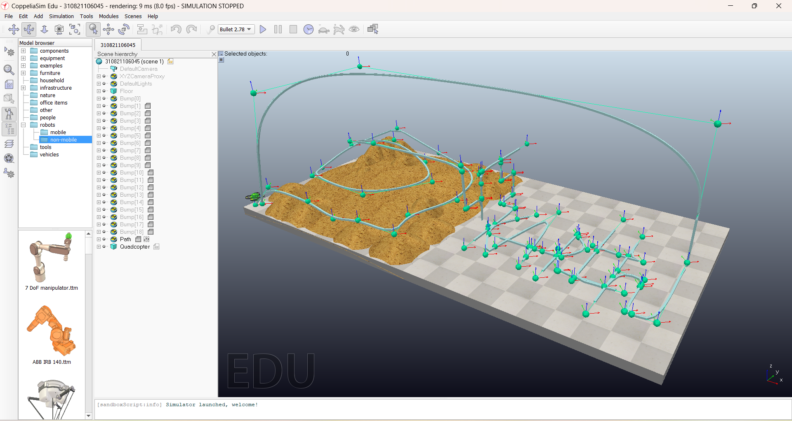
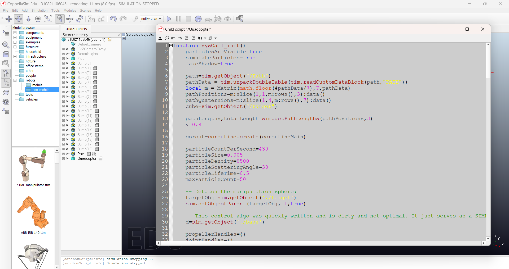
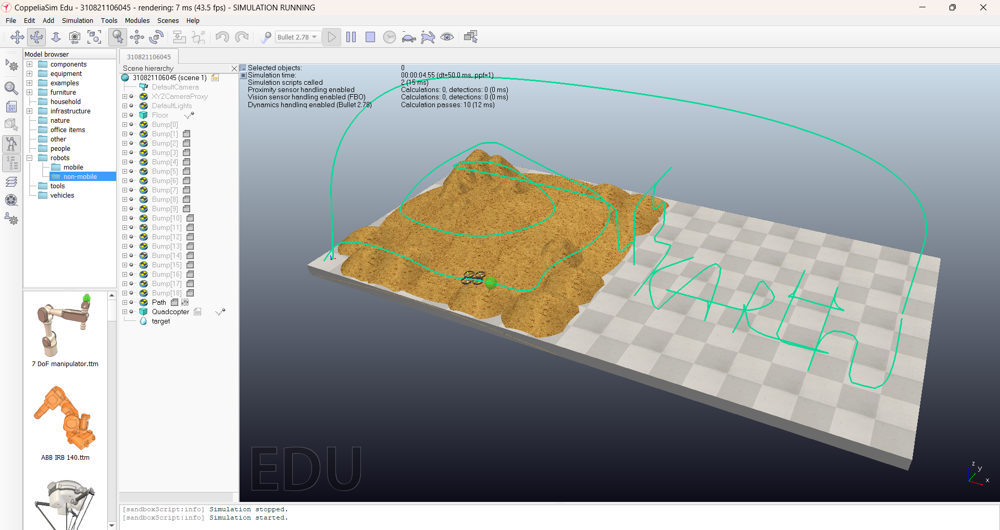

# Path-Following-Drone
Assignment for VAC

This repository contains a simulation file and scren recorded file of the running simulation.

The simulation is about making a default Drone(Quadcopter) available in the Coppeliasim software follow a PATH.

The Drone is Programmed to follow the PATH using LUA language.

The Constructed Path involves 2 Terrains. One terrain is in a muddy floor, where the Drone surfaces the path with all three coordinate movements avoiding the bumps in the path. The Drone then moves to a nearby floor, where on YZ axis it traces my Register Number and on XY axis it traces my Name.

I also included a feedback Path to the initial point.

The Screen recorded file is also included in the repository.
NOTE :- The Recorded video is a actually faster than the original simulation, which is done inorder to lower video storage size.

## Screenshots

